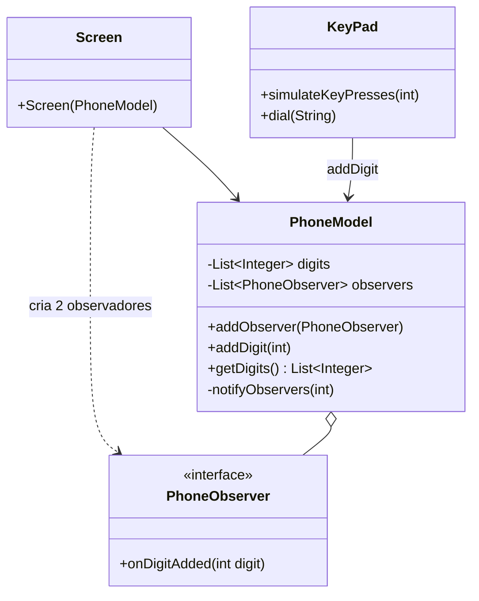

# Padrão Observer — Telefone (telephone)

Lista Avaliativa I — Padrões de Projetos Orientados a Objetos.

O `PhoneModel` (sujeito) avisa todos os `PhoneObserver` registrados sempre que um novo dígito é inserido.
A `Screen` (UI) cria dois observadores: um imprime o último dígito e o outro, quando o número tem
12 dígitos, imprime `Agora discando <número>...`.

## Papéis do padrão

| Papel no Observer | Classe |
|---|---|
| Sujeito (Subject) | `PhoneModel` |
| Observador (interface) | `PhoneObserver` |
| Observadores concretos | as duas lambdas registradas em `Screen` |
| Quem gera eventos | `KeyPad` (chama `model.addDigit`) |

## Restrições do enunciado
- **Somente a UI imprime:** `PhoneModel` e `PhoneObserver` não têm nenhum `System.out`. Quem imprime são as
  classes de interface com o usuário: `Screen` (saída) e `KeyPad` (a simulação do teclado físico, que ecoa
  a tecla pressionada, como no código inicial).
- **Telefone desacoplado da UI:** `PhoneModel` só conhece a interface `PhoneObserver`; não há nenhuma
  referência a `Screen` no modelo.



## Como executar (a partir da raiz do repositório)

```bash
javac -encoding UTF-8 -d out telephone/*.java
java -cp out Main
```

Saída (resumida):

```
Pressionando: 0
0
Pressionando: 8
8
...
Pressionando: 6
6
Agora discando 081999887766...
```

## Uso de IA
Prompts, tutorial e ajustes estão em [PROMPTS.md](PROMPTS.md). A evolução da solução pode ser lida no
histórico de commits: um commit por passo do tutorial + um commit por ajuste.
